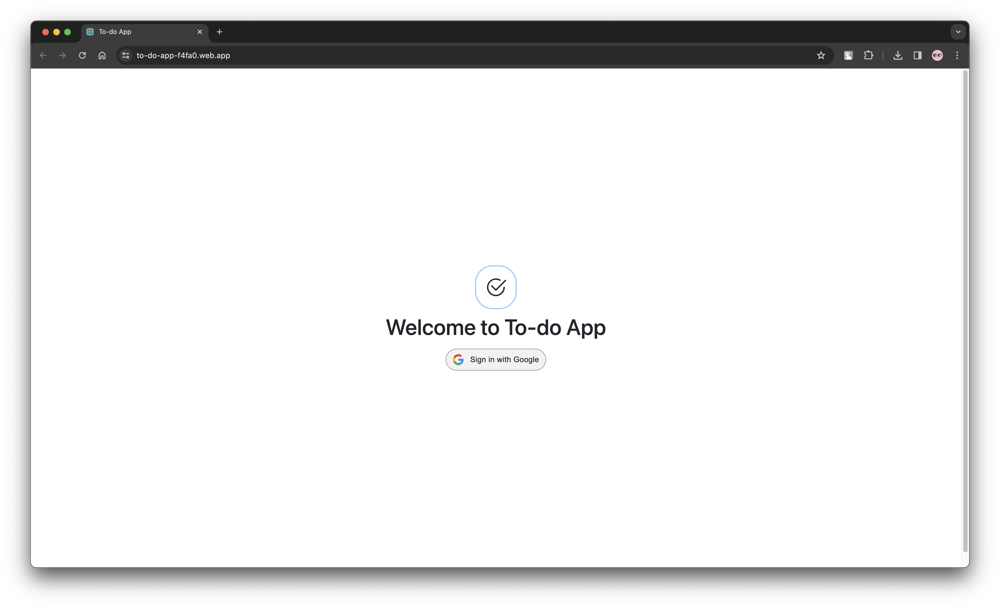
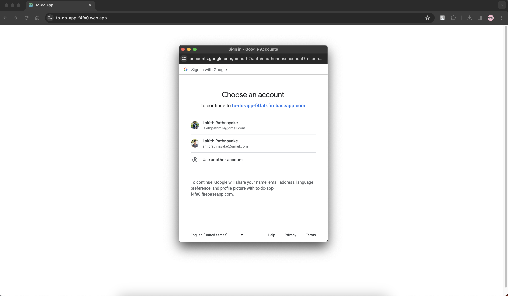
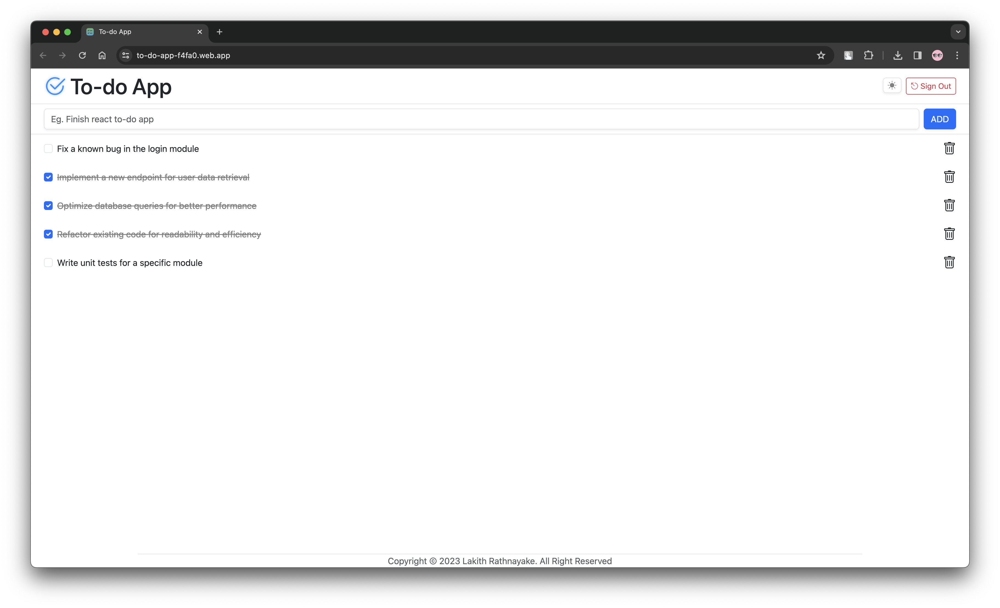
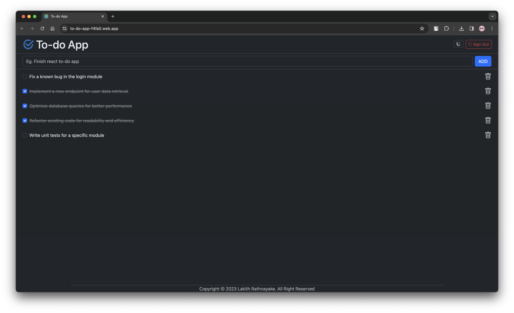
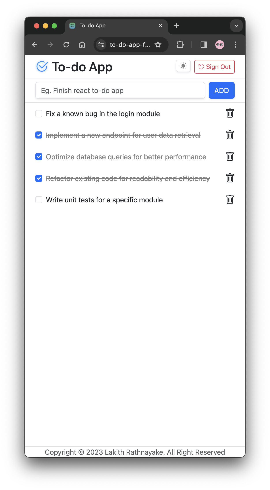

# To-do App

Frontend Deployed Link: https://to-do-app-f4fa0.web.app

## Table of Contents

- [Description](#description)
- [Features](#features)
- [Screenshots](#screenshots)
- [Technologies Used](#technologies-used)
- [Usage](#usage)
- [Contributing](#contributing)
- [Contact](#contact)
- [Version](#version)
- [License](#license)

## Description

This To-do app is a full-stack task management application that facilitates organizing tasks based on user Gmail accounts. It leverages React for the frontend, Spring Web MVC for the backend, PostgreSQL as the database, and Firebase for user authentication. This app allows users to securely manage their tasks associated with their Gmail accounts.

## Features

- **User Authentication**: Firebase Authentication is integrated to provide a secure login system via Gmail accounts.
- **Task Management by Gmail**: Users can create, mark tasks as completed, delete, and view their tasks associated with their Gmail accounts.
- **CRUD Operations**: Implements CRUD (Create, Read, Update, Delete) operations for tasks in the PostgreSQL database.
- **Gmail Integration**: Fetches and displays tasks linked to the user's Gmail account upon loading the app.
- **Scalable Database**: Utilizes PostgreSQL for efficient and scalable storage of user tasks with associated emails.
- **Frontend Deployment**: The React frontend is deployed using Firebase Hosting for seamless accessibility.

## Screenshots

### Google Sign In

### General Usage

### Dark Mode

### Mobile Responsive

## Technologies Used

### Frontend
- **React.js - 18**: Building the user interface and handling client-side logic.
- **Firebase Authentication**: Ensuring secure authentication via Gmail accounts.

### Backend
- **Spring Web MVC**: Framework for building RESTful APIs and managing backend logic.
- **Hibernate Validator**: Providing bean validation capabilities for the backend.
- **HikariCP**: High-performance JDBC connection pooling.
- **Lombok**: Reducing boilerplate code and improving code readability.
- **Jackson Databind**: Handling JSON data serialization and deserialization.
- **PostgreSQL**: Storing user tasks and their associated Gmail accounts securely.

## Usage
To use the To-do App, follow these steps:

1. **Download the Project**:
   - Download the To-do project from the [repository](https://github.com/Lakith-Rathnayake/to-do-app).

2. **Backend Setup**:
   - Open the backend folder in an IDE like IntelliJ IDEA.
   - Run `mvn clean package` to install project dependencies specified in the backend's `pom.xml`.
   - Deploy the backend on a Tomcat server within your IDE.

3. **Frontend Deployment**:
   - Access the deployed frontend using Firebase hosting at [Firebase Frontend Link](https://to-do-app-f4fa0.web.app/).
   - Use this link to access the frontend part of the application.

4. **Using the App**:
   - Access the deployed frontend application link provided above to start using To-do App.

## Contributing

If you'd like to contribute to this project, please follow these steps:

1. Fork the repository
2. Create a new branch (`git checkout -b feature/your-feature`)
3. Make your changes
4. Commit your changes (`git commit -m 'Add some feature'`)
5. Push to the branch (`git push origin feature/your-feature`)
6. Create a new pull request

## Contact

For any inquiries or support, feel free to contact the project maintainer:

- Name: [Lakith Rathnayake](https://github.com/Lakith-Rathnayake)
- Email: lakithpathmila@gmail.com
- LinkedIn: [Lakith Rathnayake](https://www.linkedin.com/in/lakith-rathnayake/)

## Version

1.0.0

## License

Copyright &copy; 2023 Lakith Rathnayake. All Rights Reserved. 
This project is licensed under the [MIT License](LICENSE.txt)
